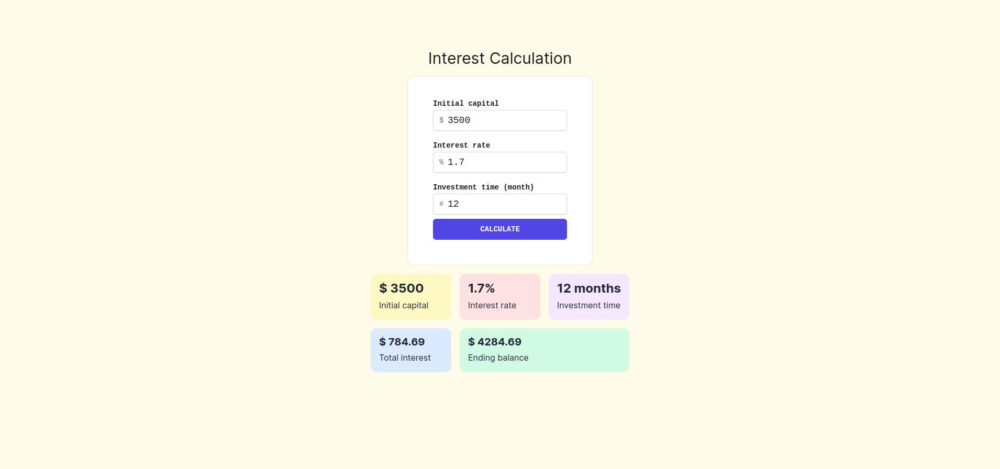

<strong><h1 align="center">Interest Calculation</h1></strong>
<p align="center"><strong>Portfolio project</strong></p>

<p align="center">
  
</p>

## 🚀 Goal
A small application that calculates the interest value and final balance of a investment.

## 🛰️ Technologies
This project was developed with the following technologies:

- Typescript
- React.js
- Next.js
- Jest
- TailwindCSS
## 💻 Installation / How to use
- Clone this repository:
   ```bash
   git clone https://github.com/jairokoning/interest-calculation-next.git
   ```
- Install dependencies:
   ```bash
   npm install
   ```
- Start the application
   ```bash
   npm run dev
   ```
- Run tests
   ```bash
   npx jest
   ```
- Open http://localhost:3000 with your browser to see the result and use the application.
   ```
---

_Developed with_ 😀 _and_ ❤️ _by [Jairo Koning](https://linkedin/in/jairokoning)_